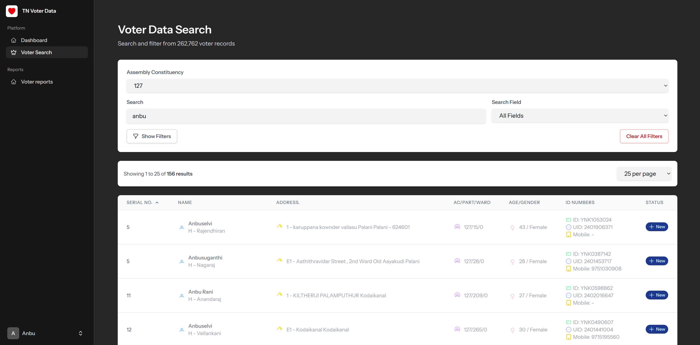
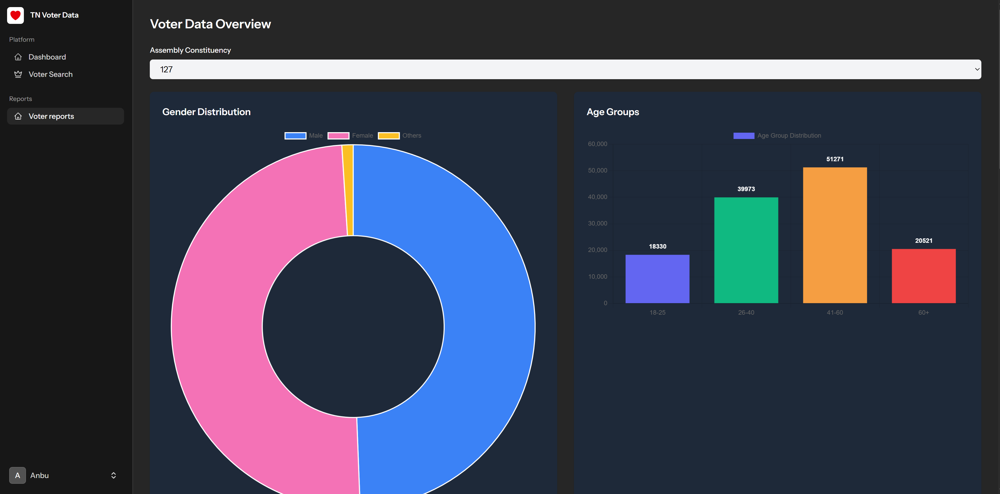

# Voter Data Search Application (voter-db-search)

A modern Laravel + Livewire application for searching, filtering, and managing voter data. This project provides a fast, user-friendly interface to query large datasets with advanced filters, sorting, and pagination.

## Features

- **Voter Data Search:**
  - Search by name, ID, mobile, house number, and more.
  - Filter by Assembly Constituency, Part Number, Ward Number, Gender, Age Range, Status, and Relationship.
  - Advanced filter panel with instant toggling.
  - Sortable, paginated results table.
  - Responsive, accessible UI with dark mode support.
- **Performance:**
  - Livewire-powered instant updates.
  - Debounced search and filter inputs for efficiency.
- **User Experience:**
  - Loading indicators and clear empty-state messages.
  - Clean, modern design with Tailwind CSS.

## Screenshots




## Getting Started

### Prerequisites
- PHP 8.1+
- Composer
- Node.js & npm
- SQLite (or configure your preferred database)

### Installation
1. Clone the repository:
   ```bash
   git clone <repo-url>
   cd voter-db-search
   ```
2. Install PHP dependencies:
   ```bash
   composer install
   ```
3. Install JS dependencies:
   ```bash
   npm install && npm run build
   ```
4. Copy `.env.example` to `.env` and set your environment variables.
5. Run migrations and seeders:
   ```bash
   php artisan migrate --seed
   ```
6. Start the development server:
   ```bash
   php artisan serve
   ```

## Usage
- Access the app at [http://localhost:8000](http://localhost:8000)
- Use the search bar and filters to find voter records.
- Click column headers to sort results.
- Use the pagination controls to navigate large datasets.

## Contributing

Contributions are welcome! To get started:

1. Fork the repository and create your branch:
   ```bash
   git checkout -b feature/your-feature
   ```
2. Make your changes and add tests if applicable.
3. Run tests:
   ```bash
   php artisan test
   # or
   ./vendor/bin/pest
   ```
4. Commit and push your changes.
5. Open a Pull Request with a clear description of your changes.

### JSON DATA
- The application uses a JSON file for initial voter data. Ensure the `voter_data.json` file is present in the `storage/app/public/` directory.

### Coding Standards
- Follow PSR-12 for PHP code.
- Use Tailwind CSS utility classes for styling.
- Write clear, descriptive commit messages.

## Authors
- [Mr. Anbuselvan Annamalai](https://fb.com/anburocky3)

## License

This project is open-source and available under the [MIT License](LICENSE).

## Acknowledgements
- [Laravel](https://laravel.com/)
- [Livewire](https://laravel-livewire.com/)
- [Tailwind CSS](https://tailwindcss.com/)
